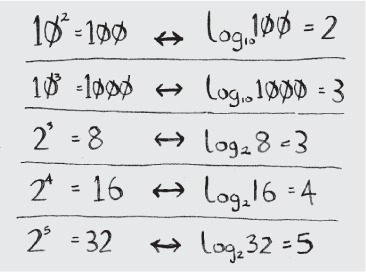

## Notes for Chapter 1 Introduction to Algorithms in [Grokking Algorithms](../)

### Binary search
Binary search is an algorithm; its input is a sorted list of elements. If an element you’re looking for is in that list, binary search returns the position where it’s located. Otherwise, binary search returns `null`.

You search in a phone book using a binary search - if the name you are looking for starts with `K`, you could start at the beginning and keep flipping pages until you get to the `K`s. But you’re more likely to start at a page in the middle, because you know the `K`s are going to be near the middle of the phone book (the second approach is an example of binary search).

The second example - a number guessing game. The algorithm for the game can be written using the following approaches:
* simple search - guess every single number until you find a correct one
* binary search - guess the number by illuminating the numbers in half

Binary search only works when your list is in sorted order. For example, the names in a phone book are sorted in alphabetical order, so you can use binary search to look for a name

### Logarithms
You may not remember what logarithms are, but you probably know what **exponentials** are. log10 100 is like asking, “How many 10s do we multiply together to get 100?” The answer is **2**: `10 × 10`. So log10 100 = 2. Logs are the flip of exponentials.

Logs are the flip of exponentials.

When you search for an element using **simple search**, in the worst case you might have to look at every single element. So for a list of 8 numbers, you’d have to check 8 numbers at most. For **binary search**, you have to check log `n` elements in the worst case. For a list of 8 elements, log `8 == 3`, because `2^3 == 8`. So for a list of 8 numbers, you would have to check `4` numbers at most. For a list of 1,024 elements, `log 1,024 = 10`, because `2^10 == 1,024`. So for a list of 1,024 numbers, you’d have to check `10` numbers at most.

### Running time

Back to binary search. How much time do you save by using it? Well, the first approach was to check each number, one by one. If this is a list of 100 numbers, it takes up to 100 guesses. If it’s a list of 4 billion numbers, it takes up to 4 billion guesses. So the maximum number of guesses is the same as the size of the list. This is called **linear time**.

Binary search is different. If the list is 100 items long, it takes at most *7* guesses. If the list is 4 billion items, it takes at most *32* guesses. Powerful, eh? Binary search runs in logarithmic time (or log time, as the natives call it). Here’s a table summarizing our findings today.

### Big O notation

`Big O` notation is special notation that tells you how fast an algorithm is.

It’s not enough to know how long an algorithm takes to run—you need to know how the running time increases as the list size increases. That’s where Big O notation comes in.

**Big O notation lets you compare the number of operations. It tells you how fast the algorithm grows.**

The run times for binary search and simple search **don’t grow at the same rate**.

**Big O establishes a worst-case run time**

Big O notation is about *the worst-case scenario*. So you can say that, in the worst case, you’ll have to look at every entry in the phone book once. That’s `O(n)` time. It’s a reassurance—you know that simple search will never be slower than `O(n)` time.

Along with the worst-case run time, it’s also important to look at the **average-case run time**.

Here are five Big O run times that you’ll encounter a lot, sorted from fastest to slowest:
* `O(log n)`, also known as log time. Example: Binary search.
* `O(n)`, also known as linear time. Example: Simple search.
* `O(n * log n)`. Example: A fast sorting algorithm, like quicksort.
* `O(n^2)`. Example: A slow sorting algorithm, like selection sort.
* `O(n!)`. Example: A really slow algorithm, like the traveling salesperson.

### Summary
* Binary search is a lot faster than simple search.
* `O(log n)` is faster than `O(n)`, but it gets a lot faster once the list of items you’re searching through grows.
* Algorithm speed isn’t measured in seconds.
* Algorithm times are measured in terms of **growth** of an algorithm.
* Algorithm times are written in Big O notation.