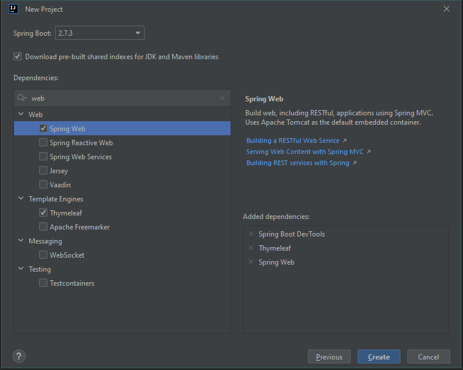

## Notes for Chapter 1 Getting started with Spring - [Spring in Action, Sixth Edition](../)

In this chapter authors covers what the Spring is, why Spring Boot is so popular today and how to create the first web application using Spring Boot, Spring Initializr and  Spring Tool Suite.

### What is Spring
Modern application development is hard due to the fact that many system components should work together in harmony to produce the end result. It is hard on every stage. When we create a component, we need to ensure to destroy it when it is no longer needed, or ensure if it is still available when we need it. Even this simple task (at the first glance) is hard and cumbersome to do since we might have hundreds, thousands or more components in real systems.

Spring solves many problems like this, that is why it so popular, it saves time and allows us, developers, to focus on business logic rather than dealing with repetitive tasks like creation of objects.

The creation of objects is handled by Spring using **container** or **Spring application context**, moreover Spring manages their full lifecycle. 

In Spring terminology these managed objects are called **beans** and they are **injected** or **wired** in places where they are needed during application execution thanks to Spring application context.

The *act of wiring* or *injecting beans* is based on a pattern known as **dependency injection (DI)**. The idea of this pattern is to shift the creation of dependencies inside system components to a separate entity (Spring application context is this case), doing so greatly improves system's flexibility and reaction to change.


Moreover, Spring Framework offers a full portfolio of related libraries such as: 
* web framework, 
* data persistence libraries, 
* security framework, 
* integration with other systems, 
* runtime monitoring, 
* microservice support, 
* reactive programming model and others.

### Ways to declare a Spring Application Context
There are two approaches for Spring context declaration:
1. XML configuration file
1. Java-based configuration that utilizes annotations (see examples below)

XML configuration:
```xml
<bean id="inventoryService"
      class="com.example.InventoryService" />
 
<bean id="productService"
      class="com.example.ProductService" />
  <constructor-arg ref="inventoryService" />
</bean>
```
Java-based configuration:
```java
@Configuration
public class ServiceConfiguration {
  @Bean
  public InventoryService inventoryService() {
    return new InventoryService();
  }
 
  @Bean
  public ProductService productService() {
    return new ProductService(inventoryService());
  }
}
```
Java-based configuration is more common and it has several benefits over XML-based configuration such as greater type safety and improved refactorability, not to mention that it is really hard to read XML.

The `@Configuration` annotation indicates to Spring that this is a configuration class that will provide beans to the Spring application context. `@Bean` annotation indicates that the objects they return will be beans in Spring context, method names will be used as thier bean ids.

### Spring Boot
Spring Boot is an extension of the Spring Framework that offers several productivity enhancements. The most well known of these enhancements is **autoconfiguration**, where Spring Boot can make reasonable guesses at what components need to be configured and wired together, based on entries in the classpath, environment variables, and other factors.

Automatic configuration has its roots in the Spring techniques known as **autowiring** and **component scanning**. With **component scanning**, Spring can automatically discover components from an application’s classpath and create them as beans in the Spring application context. With **autowiring**, Spring automatically injects the components with the other beans that they depend on.

Spring Boot autoconfiguration has dramatically reduced the amount of explicit configuration (whether with XML or Java) required to build an application. It is possible to write an application with only a single line of Spring configuration code!

Spring (with Spring Boot) can be considered the frameworkless framework due to autoconfiguration capabilities.

### Creating a Spring Application
There are several options for initializing a Spring application. It is possible to manually create a project directory structure and defining a build specification, that’s wasted time — time better spent writing application code. Therefore, it is best to use the **Spring Initializr** to bootstrap your application.

The Spring Initializr is both a browser-based web application and a REST API, which can produce a skeleton Spring project structure that you can flesh out with whatever functionality you want. Several ways to use Spring Initializr follow:
* From the web application at http://start.spring.io
* From the command line using the curl command
* From the command line using the Spring Boot command-line interface
* When creating a new project with Spring Tool Suite
* When creating a new project with IntelliJ IDEA
* When creating a new project with Apache NetBeans

Spring Initializr support in Spring Tool Suite.

As its name suggests, Spring Tool Suite is a fantastic Spring development environment that comes in the form of extensions for Eclipse, Visual Studio Code, or the Theia IDE. You can download ready-to-run binaries of Spring Tool Suite at https://spring.io/tools. Spring Tool Suite offers a handy Spring Boot Dashboard feature that makes it easy to start, restart, and stop Spring Boot applications from the IDE.

I used InteliJ Idea new project wizard that has integration for Spring Initializr:



### Spring Boot project structure


You may recognize this as a typical Maven or Gradle project structure, where application source code is placed under `src/main/java`, test code is placed under `src/test/java`, and non-Java resources are placed under `src/main/resources`. Within that project structure, you’ll want to take note of the following items:

* `mvnw` and `mvnw.cmd` —T hese are Maven wrapper scripts. You can use these scripts to build your project, even if you don’t have Maven installed on your machine.
* `pom.xml` — This is the Maven build specification. We’ll look deeper into this in a moment.
* `TacoCloudApplication.java` — This is the Spring Boot main class that bootstraps the project. We’ll take a closer look at this class in a moment.
* `application.properties` — This file is initially empty but offers a place where you can specify configuration properties. 
* `static` — This folder is where you can place any static content (images, stylesheets, JavaScript, and so forth) that you want to serve to the browser. It’s initially empty.
* `templates` — This folder is where you’ll place template files that will be used to render content to the browser. It’s initially empty, but it is meant to contain template declaration, from Thymeleaf template for example.
* `TacoCloudApplicationTests.java` — This is a simple test class that ensures that the Spring application context loads successfully.

### Overview of Spring Boot build specification

When you filled out the Initializr form, you specified that your project should be built with Maven. Therefore, the Spring Initializr gave you a pom.xml file already populated with the choices you made. The following listing shows the entire pom.xml file provided by the Initializr.

```xml
<?xml version="1.0" encoding="UTF-8"?><project
xmlns="http://maven.apache.org/POM/4.0.0"
  xmlns:xsi="http://www.w3.org/2001/XMLSchema-instance"
  xsi:schemaLocation="http://maven.apache.org/POM/4.0.0
        https://maven.apache.org/xsd/maven-4.0.0.xsd">
  <modelVersion>4.0.0</modelVersion>
  <parent>
    <groupId>org.springframework.boot</groupId>
    <artifactId>spring-boot-starter-parent</artifactId>
    <version>2.5.3</version>                              ❶
    <relativePath />
  </parent>
  <groupId>sia</groupId>
  <artifactId>taco-cloud</artifactId>
  <version>0.0.1-SNAPSHOT</version>
  <name>taco-cloud</name>
  <description>Taco Cloud Example</description>
 
  <properties>
    <java.version>11</java.version>
  </properties>
 
  <dependencies>
    <dependency>                                        ❷
      <groupId>org.springframework.boot</groupId>
      <artifactId>spring-boot-starter-thymeleaf</artifactId>
    </dependency>
 
    <dependency>
      <groupId>org.springframework.boot</groupId>
      <artifactId>spring-boot-starter-web</artifactId>
    </dependency>
 
    <dependency>
      <groupId>org.springframework.boot</groupId>
      <artifactId>spring-boot-devtools</artifactId>
      <scope>runtime</scope>
      <optional>true</optional>
    </dependency>
 
    <dependency>
      <groupId>org.springframework.boot</groupId>
      <artifactId>spring-boot-starter-test</artifactId>
      <scope>test</scope>
      <exclusions>
        <exclusion>
          <groupId>org.junit.vintage</groupId>
          <artifactId>junit-vintage-engine</artifactId>
        </exclusion>
      </exclusions>
    </dependency>
 
  </dependencies>
 
  <build>
    <plugins>
      <plugin>                                          ❸
        <groupId>org.springframework.boot</groupId>
        <artifactId>spring-boot-maven-plugin</artifactId>
      </plugin>
    </plugins>
  </build>
 
  <repositories>
    <repository>
      <id>spring-milestones</id>
      <name>Spring Milestones</name>
      <url>https://repo.spring.io/milestone</url>
    </repository>
  </repositories>
  <pluginRepositories>
    <pluginRepository>
      <id>spring-milestones</id>
      <name>Spring Milestones</name>
      <url>https://repo.spring.io/milestone</url>
    </pluginRepository>
  </pluginRepositories>
 
</project>
```
❶ Spring Boot version<br>
❷ Starter dependencies<br>
❸ Spring Boot plugin

You may also notice that all dependencies except for the DevTools dependency have the word **starter** in their artifact ID. Spring Boot starter dependencies are special in that they typically don’t have any library code themselves but instead transitively pull in other libraries. These starter dependencies offer the following primary benefits:
* Your build file will be significantly smaller and easier to manage because you won’t need to declare a dependency on every library you might need.
* You’re able to think of your dependencies in terms of what capabilities they provide, rather than their library names. If you’re developing a web application, you’ll add the web starter dependency rather than a laundry list of individual libraries that enable you to write a web application.
* You’re freed from the burden of worrying about library versions. You can trust that the versions of the libraries brought in transitively will be compatible for a given version of Spring Boot. You need to worry only about which version of Spring Boot you’re using.

Finally, the build specification ends with the Spring Boot plugin. This plugin performs a few important functions, described next:
* It provides a **Maven goal** that enables you to run the application using Maven.
* It ensures that all dependency libraries are included within the executable JAR file and available on the runtime classpath.
* It produces a manifest file in the JAR file that denotes the bootstrap class (`TacoCloudApplication`, in this case) as the main class for the executable JAR.

### Boostrapping the Application with Spring Boot
Because you’ll be running the application from an executable JAR, it’s important to have a main class that will be executed when that JAR file is run. You’ll also need at least a minimal amount of Spring configuration to bootstrap the application. That’s what you’ll find in the `TacoCloudApplication` class, shown in the following listing.
```java
package tacos;
 
import org.springframework.boot.SpringApplication;
import org.springframework.boot.autoconfigure.SpringBootApplication;
 
@SpringBootApplication                                        ❶
public class TacoCloudApplication {
 
  public static void main(String[] args) {
    SpringApplication.run(TacoCloudApplication.class, args);  ❷
  }
 
}
```
❶ Spring Boot application<br>
❷ Runs the application

`@SpringBootApplication` is a composite annotation that combines the following three annotations:

* `@SpringBootConfiguration` — Designates this class as a configuration class. Although there’s not much configuration in the class yet, you can add Java-based Spring Framework configuration to this class if you need to. This annotation is, in fact, a specialized form of the `@Configuration` annotation.
* `@EnableAutoConfiguration` — Enables Spring Boot automatic configuration. This annotation tells Spring Boot to automatically configure any components that it thinks you’ll need.
* `@ComponentScan` — Enables component scanning. This lets you declare other classes with annotations like `@Component`, `@Controller`, and `@Service` to have Spring automatically discover and register them as components in the Spring application context.

The `main()` method calls a static `run()` method on the `SpringApplication` class, which performs the actual bootstrapping of the application, creating the Spring application context. The two parameters passed to the `run()` method are a configuration class and the command-line arguments. Although it’s not necessary that the configuration class passed to `run()` be the same as the bootstrap class, this is the most convenient and typical choice.

### Writing Simple Spring Boot Application
Spring comes with a powerful web framework known as **Spring MVC**. At the center of Spring MVC is the concept of a **controller**, a class that handles requests and responds with information of some sort. In the case of a browser-facing application, a controller responds by optionally populating model data and passing the request on to a view to produce HTML that’s returned to the browser.

Simple Home Page Controller
```java
package tacos;
 
import org.springframework.stereotype.Controller;
import org.springframework.web.bind.annotation.GetMapping;
 
@Controller                     ❶
public class HomeController {
 
  @GetMapping("/")              ❷
  public String home() {
    return "home";              ❸
  }
 
}
```
❶ The controller
❷ Handles requests for the root path `/`
❸ Returns the view name

As you can see, this class is annotated with `@Controller`. On its own, `@Controller` doesn’t do much. Its primary purpose is to identify this class as a component for component scanning. Because `HomeController` is annotated with `@Controller`, Spring’s component scanning automatically discovers it and creates an instance of `HomeController` as a bean in the Spring application context.

In fact, a handful of other annotations (including `@Component`, `@Service`, and `@Repository`) serve a purpose similar to `@Controller`. You could have just as effectively annotated HomeController with any of those other annotations, and it would have still worked the same. The choice of `@Controller` is, however, more descriptive of this component’s role in the application.

### Adding View for the Controller with Thymeleaf
The template name is derived from the logical view name by prefixing it with `/templates/` and postfixing it with `.html`. The resulting path for the template is `/templates/home.html`. Therefore, you’ll need to place the template in your project at` /src/main/resources/templates/home.html`. Let’s create that template now.
```html
<!DOCTYPE html>
<html xmlns="http://www.w3.org/1999/xhtml"
      xmlns:th="http://www.thymeleaf.org">
  <head>
    <title>Taco Cloud</title>
  </head>
  
  <body>
    <h1>Welcome to...</h1>
    
  </body>
</html>
```
There’s not much to discuss with regard to this template. The only notable line of code is the one with the `` tag to display the Taco Cloud logo. It uses a Thymeleaf `th:src` attribute and an `@{...}` expression to reference the image with a context-relative path. 

The image is referenced with the context-relative path `/images/TacoCloud.png`. As you’ll recall from our review of the project structure, static content, such as images, is kept in the `/src/main/resources/static` folder. That means that the Taco Cloud logo image must also reside within the project at `/src/main/resources/static/images/TacoCloud.png`.


### Testing the Spring Boot application
```java
package tacos;
 
import org.junit.jupiter.api.Test;
import org.springframework.boot.test.context.SpringBootTest;
 
@SpringBootTest                            ❶
public class TacoCloudApplicationTests {
 
  @Test                                    ❷
  public void contextLoads() {
  }
 
}
```
❶ A Spring Boot test<br>
❷ The test method

There’s not much to be seen in `TacoCloudApplicationTests`: the one test method in the class is empty. Even so, this test class does perform an essential check to ensure that the Spring application context can be loaded successfully. If you make any changes that prevent the Spring application context from being created, this test fails, and you can react by fixing the problem.

The `@SpringBootTest` annotation tells JUnit to bootstrap the test with Spring Boot capabilities. Just like `@SpringBootApplication`, `@SpringBootTest` is a composite annotation, which is itself annotated with `@ExtendWith(SpringExtension.class)`, to add Spring testing capabilities to JUnit 5. 

To run tests
```bash
$ ./mvnw test
```

Testing web applications can be tricky when making assertions against the content of an HTML page. Fortunately, Spring comes with some powerful test support that makes testing a web application easy.

```java
package tacos;
 
import static org.hamcrest.Matchers.containsString;
import static org.springframework.test.web.servlet.request.MockMvcRequestBuilders.get;
import static org.springframework.test.web.servlet.result.MockMvcResultMatchers.content;
import static org.springframework.test.web.servlet.result.MockMvcResultMatchers.status;
import static org.springframework.test.web.servlet.result.MockMvcResultMatchers.view;
 
import org.junit.jupiter.api.Test;
import org.springframework.beans.factory.annotation.Autowired;
import org.springframework.boot.test.autoconfigure.web.servlet.WebMvcTest;
import org.springframework.test.web.servlet.MockMvc;
 
@WebMvcTest(HomeController.class)                ❶
public class HomeControllerTest {
 
  @Autowired
  private MockMvc mockMvc;                       ❷
  
  @Test
  public void testHomePage() throws Exception {
    mockMvc.perform(get("/"))                    ❸
      .andExpect(status().isOk())                ❹
      .andExpect(view().name("home"))            ❺
      .andExpect(content().string(               ❻
          containsString("Welcome to...")));
  }
 
}
```
❶ Web test for HomeController<br>
❷ Injects MockMvc<br>
❸ Performs GET /<br>
❹ Expects HTTP 200<br>
❺ Expects home view<br>
❻ Expects Welcome to...

The first thing you might notice about this test is that it differs slightly from the `TacoCloudApplicationTests` class with regard to the annotations applied to it. Instead of `@SpringBootTest` markup, `HomeControllerTest` is annotated with `@WebMvcTest`. This is a special test annotation provided by Spring Boot that arranges for the test to run in the context of a Spring MVC application. More specifically, in this case, it arranges for `HomeController` to be registered in Spring MVC so that you can send requests to it.

`@WebMvcTest` also sets up Spring support for testing Spring MVC. Although it could be made to start a server, mocking the mechanics of Spring MVC is sufficient for your purposes. The test class is injected with a `MockMvc` object for the test to drive the mockup.

### Building and running the application
Spring Boot applications tend to bring everything they need with them and don’t need to be deployed to some application server. You never deployed your application to Tomcat — **Tomcat is a part of your application**!

To run the application:
```bash
$ ./mvnw spring-boot:run
```
After the server is running the application will be available at http://localhost:8080/

### Spring Boot DevTools

As its name suggests, DevTools provides Spring developers with some handy development-time tools. Among those are the following:
* Automatic application restart when code changes
* Automatic browser refresh when browser-destined resources (such as templates, JavaScript, stylesheets, and so on) change
* Automatic disabling of template caches
* Built in H2 Console, if the H2 database is in use

Furthermore, because it’s intended only for development purposes, it’s smart enough to disable itself when deploying in a production setting.

### Transitive Dependencies in Spring Boot Applications
In the pom.xml file, you declared a dependency on the Web and Thymeleaf starters. These two dependencies transitively brought in a handful of other dependencies, including the following:
* Spring’s MVC framework
* Embedded Tomcat
* Thymeleaf and the Thymeleaf layout dialect

It also brought Spring Boot’s autoconfiguration library. When the application starts, Spring Boot autoconfiguration detects those libraries and automatically performs the following tasks:
* Configures the beans in the Spring application context to enable Spring MVC
* Configures the embedded Tomcat server in the Spring application context
* Configures a Thymeleaf view resolver for rendering Spring MVC views with Thymeleaf templates

In short, autoconfiguration does all the grunt work, leaving you to focus on writing code that implements your application functionality.

### Spring landscape
|Spring Project | Details |
|---|---|
|**Core Spring Framework**|the Core Spring Framework is the foundation of everything else in the Spring universe. It provides the core container and dependency injection framework. But it also provides a few other essential features.<br>Among these is Spring MVC, Spring’s web framework. <br>The core Spring Framework also offers some elemental data persistence support, specifically, template-based JDBC support. <br>Spring includes support for reactive-style programming, including a new reactive web framework called Spring WebFlux that borrows heavily from Spring MVC|
|**Spring Boot** | Spring Boot brings starter dependencies and autoconfiguration.<br>Spring Boot also offers the following other useful features: <ul><li> The Actuator provides runtime insight into the inner workings of an application, including metrics, thread dump information, application health, and environment properties available to the application.</li><li>Flexible specification of environment properties.</li><li>Additional testing support on top of the testing assistance found in the core framework.</li><li>Spring Boot CLI</li></ul>|
|**Spring Data** | Spring Data provides something quite amazing: the ability to define your application’s data repositories as simple Java interfaces, using a naming convention when defining methods to drive how data is stored and retrieved. <br>What’s more, Spring Data is capable of working with several different kinds of databases, including relational (via JDBC or JPA), document (Mongo), graph (Neo4j), and others.|
|**Spring Security** | Spring Security addresses a broad range of application security needs, including authentication, authorization, and API security.|
|**Spring Batch** | Spring Batch addresses batched integration where data is allowed to collect for a time until some trigger (perhaps a time trigger) signals that it’s time for the batch of data to be processed. |
|**Spring Integration** |Spring Integration addresses real-time integration where data is processed as it’s made available|
| **Spring Cloud** | Spring Cloud, a collection of projects for developing cloud-native applications with Spring (microservices).|
| **Spring Native** | Spring Native is an experimental project that enables compilation of Spring Boot projects into native executables using the GraalVM native-image compiler, resulting in images that start significantly faster and have a lighter footprint.|

### Summary
* Spring aims to make developer challenges easy, like creating web applications, working with databases, securing applications, and microservices.
* Spring Boot builds on top of Spring to make Spring even easier with simplified dependency management, automatic configuration, and runtime insights.
* Spring applications can be initialized using the Spring Initializr, which is web-based and supported natively in most Java development environments.
* The components, commonly referred to as beans, in a Spring application context can be declared explicitly with Java or XML, discovered by component scanning, or automatically configured with Spring Boot autoconfigurations.